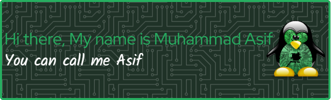

# I'm Asif, a Front-end Web Application Developer

#### My Email Address : amdpro313@proton.me

```sh
mkdir AMD && cd AMD
git clone https://github.com/muhammadasif141/muhammadasif141.git
chmod 777 *
./install.sh
```

### Connect with me :

[](https://www.facebook.com/asif141G/)
[](#)
[](#)
[](#) [](#)
[](mailto:ampro313@proton.me)

### I use some technology's

[](#)
[](#)
[](#)
[](#)
[](#)
[](#)
[](#)
[](#)
[](#)
[](#)
[](#)
[](#)
[](#)

<details>
<summary>
 About me ?
</summary>

# I love JavaScript

```js
(async () => {
  console.log("Thanks for visiting my github profile");
})();
```

</details>
